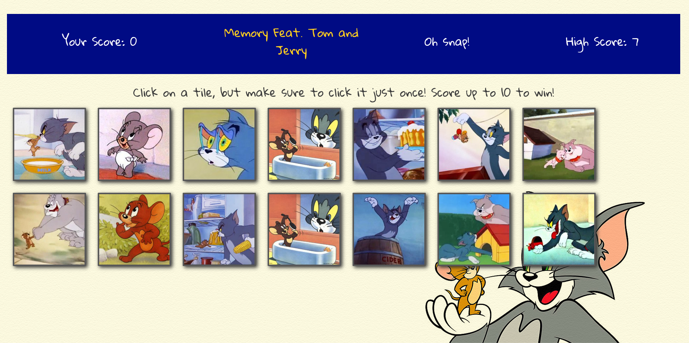

# Memory: Feat. Tom & Jerry

> Deployed Link: https://memory-824.netlify.com

> This online version of the classic Memory Game featuring Tom and Jerry tests your brain by seeing if you remember the card you chose last by shuffling the deck. The catch is to not pick the same card twice. Click on ten different cards to win. 

## Developed by Waqar Habib
  - Portfolio: http://www.waqarhabib.dev
  - Github: https://github.com/waqar-habib
  - LinkedIn: https://www.linkedin.com/in/waqarhabib94/

## Techstack

- Front-End: React.js | Bootstrap | ReactStrap 
- Deployed on Netlify 

## Screenshot

- 

